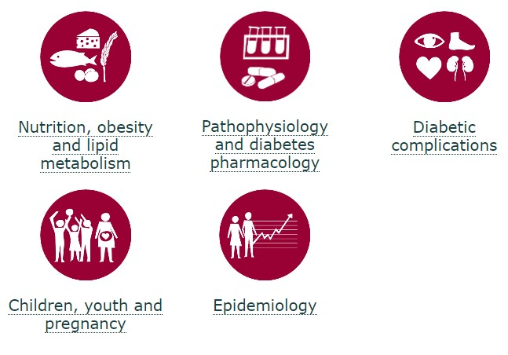

Steno Diabetes Center Aarhus covers a wide range of research areas. A patient-centered approach is achieved by research activities relevant to prevention and treatment of diabetes, or contribution to the understanding of the disease in humans.

We build upon a well-established research environment and long-standing collaborations between Aarhus University, Aarhus University Hospital and other hospitals in the Central Region of Denmark.

For more information on the research groups, please visit:

- https://www.stenoaarhus.dk/Research/
- https://twitter.com/stenoaarhusres 
